## COMPILER OPTIMIZATION TECHNIQUES
##### CSE351 - PROGRAMMING LANGUAGES - TERM PROJECT
This Project Includes the Implementation of Five Fundamental Compiler Optimization Techniques:
1. **Constant Folding**
2. **Constant Propagation**
3. **Algebraic Simplification**
4. **Common Subexpression Elimination**
5. **Dead Code Elimination**
   
The Project is Implemented Using Flex for Lexical Analysis and Yacc/Bison for Parsing and Transformations.

---

## Abstract
This project explores five fundamental compiler optimization techniques to enhance program efficiency, reduce redundancy, and minimize execution time. The techniques covered include Constant Folding, Constant Propagation, Algebraic Simplification, Common Subexpression Elimination, and Dead Code Elimination. Each optimization is implemented as a separate module utilizing Flex for lexical analysis and Yacc/Bison for parsing and transformations. The project demonstrates the application of these optimizations on sample inputs, evaluates their impact on performance, and validates the correctness of the results against expected outputs. A modular design approach ensures clarity and extensibility, while rigorous testing highlights the efficacy of these optimizations in improving compiler-generated code. The outcomes underline the importance of compiler optimizations in modern programming practices and provide a foundation for future enhancements in this domain.

## Aknowledgements
**Prof. Dr. GÜRHAN KÜÇÜK** taught the course and supervised the project. Thanks to him for his guidance and support.

## Table of Contents

- [Introduction](#introduction)
- [Explanation of Algorithms](#explanation-of-algorithms)
  - [Constant Folding](#constant-folding)
  - [Constant Propagation](#constant-propagation)
  - [Algebraic Simplification](#algebraic-simplification)
  - [Subexpression Elimination](#subexpression-elimination)
  - [Dead Code Elimination](#dead-code-elimination)
- [Design and Implementation](#design-and-implementation)
  - [Overview of the Folder Structure](#overview-of-the-folder-structure)
  - [Implementation Details for Each Algorithm](#implementation-details-for-each-algorithm)
    - [Constant Folding](#constant-folding-1)
    - [Copy or Constant Propagation](#copy-or-constant-propagation)
    - [Algebraic Simplification](#algebraic-simplification-1)
    - [Common Subexpression Elimination](#common-subexpression-elimination)
    - [Dead Code Elimination](#dead-code-elimination-1)
- [Testing and Results](#testing-and-results)
  - [Test Inputs and Expected Outputs](#test-inputs-and-expected-outputs)
  - [Makefile to Run All Tests](#makefile-to-run-all-tests)
  - [Observations](#observations)
- [Conclusion](#conclusion)
- [References](#references)

## Introduction

Optimizing  compilers  apply  a  series  of  source  code  transformations  (or  its  intermediate representations)  to  maximize  runtime  efficiency,  to  minimize  code  size,  and  to  reduce  its complexity.  This  project  considers  five  fundamental  compiler  optimization  techniques,  each implemented as a separate module using Flex for lexical analysis and Yacc/Bison for parsing and transformation. The optimizations done are: 

1. **Constant Folding** 
2. **Copy or Constant Propagation** 
3. **Algebraic Simplification** 
4. **Common Subexpression Elimination** 
5. **Dead Code Elimination** 

For each technique, we implemented specific parsers and transformers and tested them on sample inputs in order to prove their correctness by comparing the obtained results with the expected outputs. The structure of the report is as follows: 

- **Section 2:** Provides an overview of the concepts underlying each of the five optimization techniques. 
- **Section 3:** Outlines the design and implementation process, including the role of the lexer, parser, and the specific approach for each optimization. 
- **Section 4:** Describes the testing methodology and presents the results obtained from the sample cases. 
- **Section 5:** Concludes with a summary of the project's findings. 

This report demonstrates real-life application and effectiveness of such optimization techniques, and  thus  it  adds  to  a  better  understanding  of  compiler  design  and  functionality. 

## Explanation of Algorithms

### Constant Folding

Constant Folding is a technique of optimization where constant expressions are evaluated at compile time instead of runtime. In a statement like a = 2 + 3;, the compiler replaces 2 + 3 with 5. This saves the computer from doing unnecessary calculations when the program is executed. 

**Key Concept**: If both operands of an operation are constants, then evaluate the result at compile- time and replace the expression with the computed value. 

### Constant Propagation

Constant Propagation. This optimization replaces variables by their known constant values at compile time. For example, if a variable is assigned a constant (d = 4;) and later used in an expression (c = d + 5;), the compiler may substitute d by 4, making the expression c = 4 + 5;. 

**Key  Concept:**  Maintain  a  record  of  variables  assigned  constant  values  and  substitute  their occurrences in expressions by the corresponding constants. 

### Algebraic Simplification

Algebraic Simplification: This pattern uses simple mathematical identities to simplify expressions. Operations such as adding or subtracting zero, multiplying by one, or similar adjustments can be used to lower the complexity of code: 

**Examples**: 

- x + 0 → x 
- x - 0 → x 
- x \* 1 → x 
- 0 \* x → 0 
- 0 / x → 0 
- x^2 → x \* x  

**Key Concept:** Look for expressions that match standard algebraic rules and simplify them to make the code smaller and less complex. 

### Subexpression Elimination

Subexpression  Elimination,  or  Common  Subexpression  Elimination,  CSE,  finds  repeated expressions in the source code and replaces them with a single precomputed value stored in a temporary variable. 

**Example:** 

- x = y + z;   
- w = y + z;   
- The expression y + z is repeated twice here. One can replace the second occurrence with x and eliminate the repetition of computation by using an intermediate variable:. 

**Key Concept:** Keep track (e.g., via map or dictionary) of expressions that have been computed and reuse the result whenever possible to save redundant computations. 

### Dead Code Elimination

Dead Code Elimination eliminates the assignments to variables that are never used in the program. **Example:** 

- a = b;   
- x = 2 \* b;  // used later   
- p = z + y;  // never used afterward   
- In this example, the statement p = z + y; does not a↵ect the program's outcome because p is never used. It can be safely removed. 

**Key Concept:** Analyze the program backward, starting from the final statements, to identify variables that are still "live" (used in subsequent computations). Discard assignments to variables 

that do not contribute to any live value. 

Together, these optimizations improve code efficiency and redundancy and enhance the overall performance of compiled programs. 

## Design and Implementation

### Overview of the Folder Structure

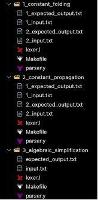 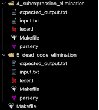

***Figure 1*** *Folder Structure of Term Project* 

1. **Lexical Analysis (Flex):** 
- A single lexer.l file is provided (or nearly identical across all optimizations). 
- It recognizes tokens such as variables (TOKEN\_VAR), numbers (TOKEN\_NUM), and operators (+, -, \*, /, ^, =). 
1. **Parsing and Transformation (Yacc/Bison):** 
- Each optimization has its own parser.y, which contains the grammar rules. 
- Within these grammar rules, we embed the transformation logic:  
- **Constant Folding**: Evaluate expressions if both operands are numeric. 
- **Copy orConstant Propagation**: Maintain a map of variable-to-constant and substitute when possible. 
- **Algebraic Simplification**: Match patterns (x+0, etc.) and output a simplified assignment. 
- **Common Subexpression Elimination**: Maintain a map from expression strings to a variable holding that expression. If it appears again, replace with the variable. 
- **Dead Code Elimination**: Store all assignments in a list, then perform a backward pass to check which assignments are used before printing them. 
1. **Makefiles for Each Optimization:** 
- Each directory (1 to 5) has a dedicated Makefile to build and run the corresponding optimization. 
- A final “master” Makefile (makefile for all tests) runs each project’s tests and displays the result. 
### Implementation Details for Each Algorithm
#### Constant Folding

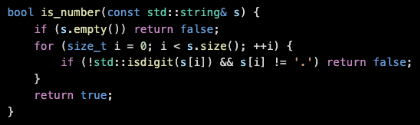

***Figure 2**  Helper Function is\_number for Constant Folding* 

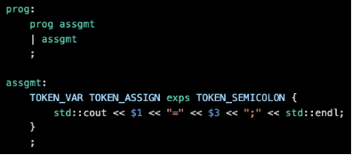

***Figure 3** Prog and assgmt rules for Constant Folding* 

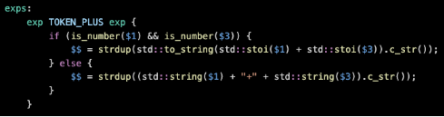

***Figure 4** General rule for operators in Constant Folding* 

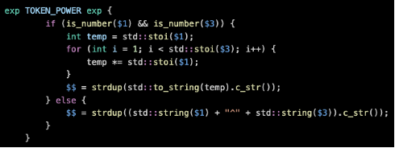

***Figure 5** Special rule for the power operator in Constant Folding* 

Constant folding has been integrated into the parser in order to optimize arithmetic expressions as they are parsed by evaluating constant sub-expressions at compile time. The non-terminal exps manages operations including addition, subtraction, multiplication, division, and exponentiation. A helper function, is\_number, is used to check if both operands are numeric. If they are, then the parser evaluates the result immediately and substitutes the expression with its constant value. Otherwise, it constructs a symbolic string representation, which allows the program to manipulate mixed  expressions  dynamically.  This  approach  avoids  most  of  the  calculations  at  runtime, precomputing  the  constants,  hence  it  is  efficient  in  execution  but  still  flexible  enough  for expressions involving variables or symbolic terms. 

#### Copy or Constant Propagation

***Figure 6** Implentation unordered\_map* 

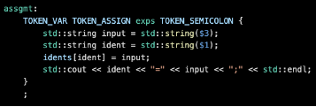

***Figure 7** assgmt rule for Copy or Constant Propagation* 

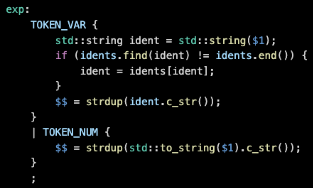

***Figure 8** exp rule for Copy or Constant Propagation* 

Constant propagation is implemented as part of the parser to improve performance by substituting variable references with their constant values wherever possible. This optimization makes use of a global unordered\_map called idents to keep track of mappings of variables to their values assigned. Similarly, when parsing an expression (exp), a variable (TOKEN\_VAR) is looked up in the idents map. If it is found, its value is substituted before continuing to parse the rest of the expression; in this way, expressions with constants are simplified during parsing. This reduces lookup  and  calculation  at  runtime,  but  the  design  also  supports  variable  reassignments  by delivering  the  latest  values  to  the  optimization  to  capture  any  changes,  and  by  making  the expression flexible if it is not a constant.

#### Algebraic Simplification

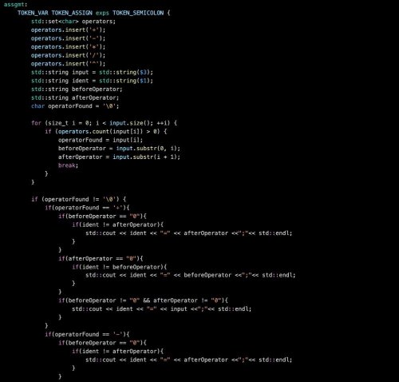

***Figure 9** assgmt rule for Algebraic Simplification Part 1* 

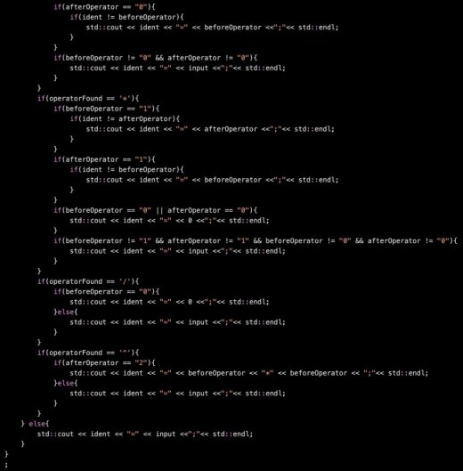

***Figure 10** assgmt rule for Algebraic Simplification Part 2* 

There's also algebraic simplification being done in the parser; arithmetic expressions are simplified following common rules of mathematics. That is done as part of the assgmt (assignment) rule. The rule parses an expression containing operators such as +, -, \*, / and ^ in such a way that it can recognize certain simplifications. Particular patterns, such as addition or subtraction of zero, multiplication by one, multiplication by zero, or squaring of a variable, are detected and simplified: for example, x + 0 simplifies to x, x \* 1 remains x, and x \* 0 becomes 0. Likewise, an expression such as x^2 is transformed into x \* x. That kind of simplifications decrease the complexity of generated  expressions  and  improve  their  execution  performance  by  preventing  redundant calculations. At the same time, non-redundant expressions are not changed, so the output of the program is preserved correct and only meaningful optimizations are applied.** 

#### Common Subexpression Elimination

***Figure 11** Implementation of exps\_map* 

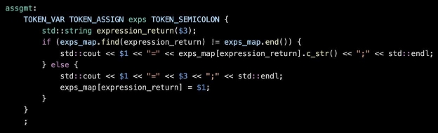

***Figure 12** assgmt rule of Common Subexpression Elimination*** 

The CSE is realized by means of a built-in parser in order to evaluate the same expression only once. It relies, therefore, on the following globalunordered\_map<exp/var\_set> exps\_mapto keep track of expressions along with their variables; then, when parsing any kind of assignment**   assgmt** , its right-hand-side expression**  exps**  is run against this map:. If the expression already exists, instead of computing/assigning the same expression, the parser reuses the associated variable name. The parser stores new expressions along with their associated variables into the map. This makes the approach efficient and reduces the consumption of memory if there are complex or repetitive computations involved. The implementation keeps computational overhead minimal while obtaining precise results. 

#### Dead Code Elimination

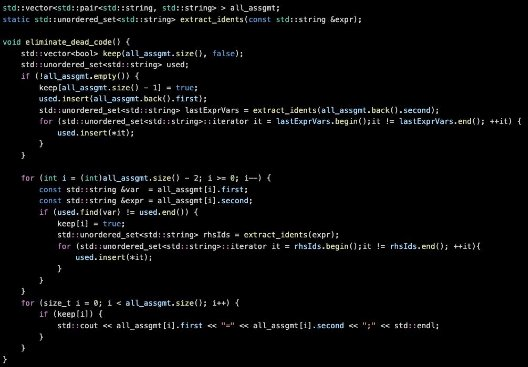

***Figure 13** Function to eliminate dead code.* 

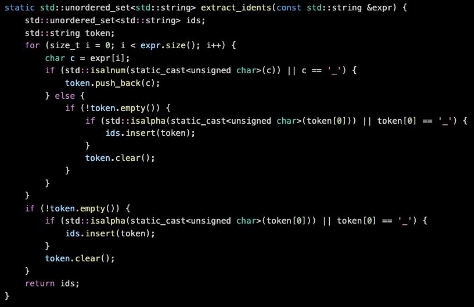

***Figure 14** Helper function to extract identifiers.* 

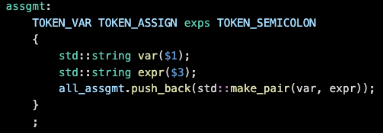

***Figure 15** Rule for parsing assignments.* 

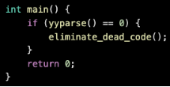

***Figure 16** Main function calling dead code elimination.* 

Dead code elimination  implemented in the parser  is the elimination of unused assignments, ensuring that the generated code only includes computations that are effectively needed. This optimization uses a global vector, all\_assgmt, to keep track of variable assignments in the order they are parsed. After parsing, the eliminate\_dead\_code function processes these assignments in reverse,  determining  which  variables  are  actually  used  in  later  computations. An  auxiliary function, extract\_idents, discovers variable references within expressions and is complemented by using a std::unordered\_set to keep track of used variables. The assignment is erased if its value is no longer needed. This ensures that only the assignments contributing to either the outputs or to further computations are retained, which in turn reduces memory usage, making execution more efficient. Correctness is ensured through careful consideration of all the dependencies, making this implementation reliable for large and complex computations. 

## Testing and Results

### Test Inputs and Expected Outputs

Each optimization includes one or more sample input files and corresponding expected outputs. Below is an example for **Constant Folding**: 

|_input.txt_ | _expected\_output.txt_ | _input.txt_ | _expected\_output.txt_ |
| - | - | - | - |
|d=4;  a=2+2;  b=2^9;  c=d^3;  e=5;  f=3\*4;  g=6/2;  h=m;  p=0;  j=j+p;  r=e\*p;  s=a; |d=4;  a=4;  b=512;  c=d^3;  e=5;  f=12;  g=3;  h=m;  p=0;  j=j+p;  r=e\*p;  s=a;  |d=4;  a=2+2;  b=2^9;  c=4^3;  e=5;  f=3\*4;  g=6/2;  h=m;  p=0;  j=j+0;  r=5\*0;  s=a;  |d=4;  a=4;  b=512;  c=64;  e=5;  f=12;  g=3;  h=m;  p=0;  j=j+0;  r=0;  s=a; |

***Table 1** Inputs  and Expected Outputs of Constant Folding* 

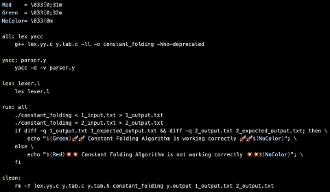

***Figure 17** Makefile of Constant Folding* 

After  compiling  (using  make  run)  and  running  the  optimizer  (./constant\_folding  <  1\_input.txt  > 1\_output.txt), the script compares 1\_output.txt with the expected output to confirm correctness. 

Similar test input-output pairs are provided for Constant Propagation, Algebraic Simplification, Subexpression Elimination, and Dead Code Elimination. Each directory has a dedicated make run command that performs the transformation, compares the result with the expected output, and prints success/failure messages. 

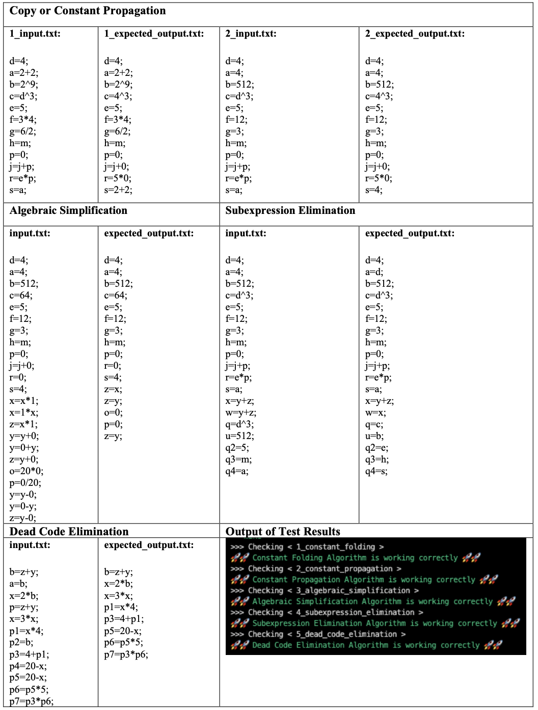

***Table 2** All tests and result* 

### Makefile to Run All Tests

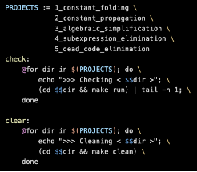

***Figure 18** Makefile to run all tests* 

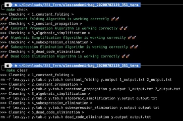

***Figure 19** Execution of Make Check and Make Clear Rules* 

**Make check**: Loops through projects, runs make run in each directory, and shows the last line of output. 

**Make clear**: Iterates over projects, runs make clean in each directory to remove any build artifacts. 

### Observations

All the transformations behaved as expected when tested. The constant expressions got simplified, known constants got replaced, simple algebraic rules were applied, redundant expressions were combined and unused assignments got eliminated. In order to keep the code manageable and well- organized, every transformation was placed in a separate directory and used the same lexical specification lexer.l thus being modular and easy to extend or debug. 

## Conclusion

The present project has achieved and evaluated the efficiency of five crucial compiler optimization techniques namely: Constant Folding, Constant Propagation, Algebraic Simplification, Common Subexpression Elimination and Dead Code Elimination. All the optimization produced significant enhancement in the code efficiency where redundancy has been cut down and runtime improved. 

This is due to the fact that the design of the system was modular where Flex was used for lexical analysis and Yacc/Bison for parsing which made the implementations clear and organized, and also helped with testing and debugging. The output of the test cases were in line with what was expected indicating that the optimizations that were used were correct and efficient. 

This work thus demonstrates the relevance of compiler optimizations in the current practice of programming, thus enhancing the appreciation of the importance of optimizations done during the compilation stage on the performance and resource consumption of software. Future work can also involve the addition of new optimization techniques and the assessment of their performance on bigger programs. 

## References

Aho, A. V., Lam, M. S., Sethi, R., & Ullman, J. D. (2006). *Compilers: Principles, Techniques, & Tools*. Pearson. 

Cooper, K. D., & Torczon, L. (2011). *Engineering a Compiler*. Morgan Kaufmann. 
21
# compiler-optimization-techniques
